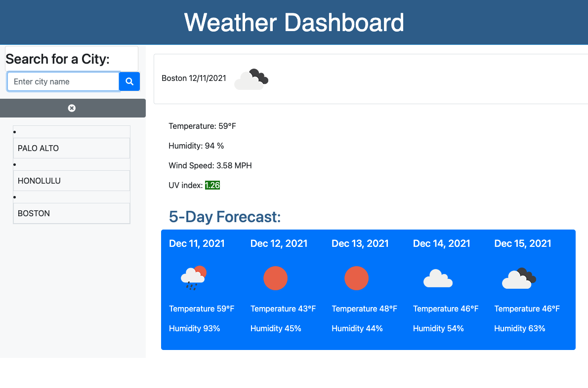

# Weather-Dashboard

## Weather-Dashboard Application

## Purpose

The purpose of this project is to create an application that allows the user to retrieve weather information for any city they desire. The user is able to access weather information for a given city for the current day as well as for the next 5-days.
I created the Weather Dashboard using data from a third-party API (OpenWeather API). Third-party APIs allow developers to access their data by making requests to a URL.
This applications runs on the browser and features dynamically updated HTML AND CSS.

## Built With

HTML

CSS/Bootstrap

JavaScript/jQuery

## Website

https://jojochun.github.io/weather-dashboard/

## Contribution

Made with ❤️ by Joanne Chun
